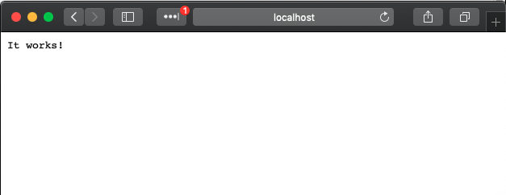

# Concurrency Server

This is a contrived server built for the intent of talking about concurrency, in
iOS at the March 2020 Learn Swift Boston meetup. The server is developed using
Vapor 3.1.10.

## Setup
If you don't already have it, you'll need [Homebrew](https://brew.sh) to install
Vapor. Simply run the following command in a terminal window.
```
/bin/bash -c "$(curl -fsSL https://raw.githubusercontent.com/Homebrew/install/master/install.sh)"
```

## Installing The Server

First you must have Vapor installed. For more information, please see [Vapor's installation documentation](https://docs.vapor.codes/3.0/install/macos/). To
install Vapor, paste the below two commands into a terminal window:

```
brew tap vapor/tap
brew install vapor/tap/vapor
```

Once the installation is complete, you can verify Vapor was successfully
installed by running the following:

```
vapor --help
```

If Vapor was installed correctly, you should see the list of available commands.
You will not need those to run this server.

## Fetching Dependencies

Xcode 11.3 has Swift Package Manager integrations out of the box. So to generate
the project file, and download the dependencies, all you have to do is double
click on the `Package.swift` file.

## Running The Server

Once all of the packages have been downloaded (and the spinners disappear), you
can run the project like any other Xcode project. Just be sure to select the
`Run` scheme with `My Mac` as the target. 

To verify the server is running, open a browser window (e.g. Safari) and go to
[localhost:8080](localhost:8080).


## Endpoints

Endpoints used in the meetup's session are [documented](documentation/Endpoints.md).
Additional endpoints, that were auto generated by Vapor, were left in for curious
coders but remain undocumented.
